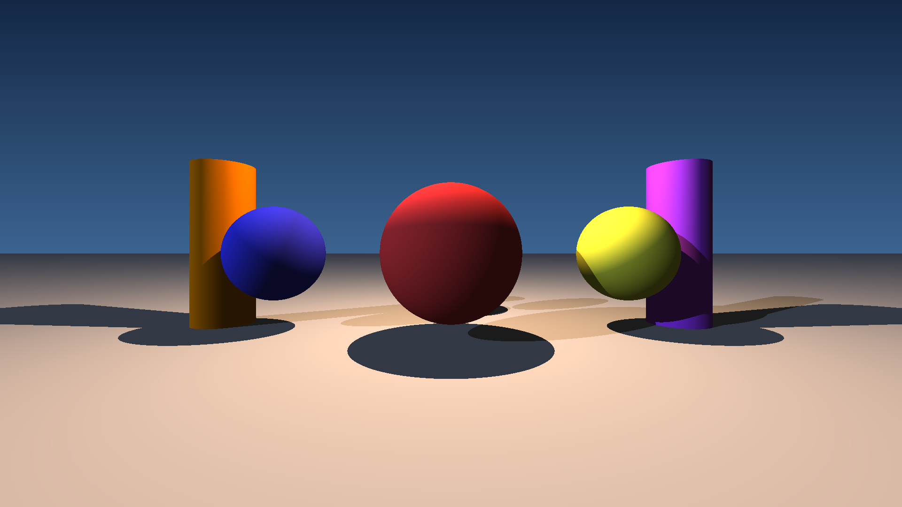
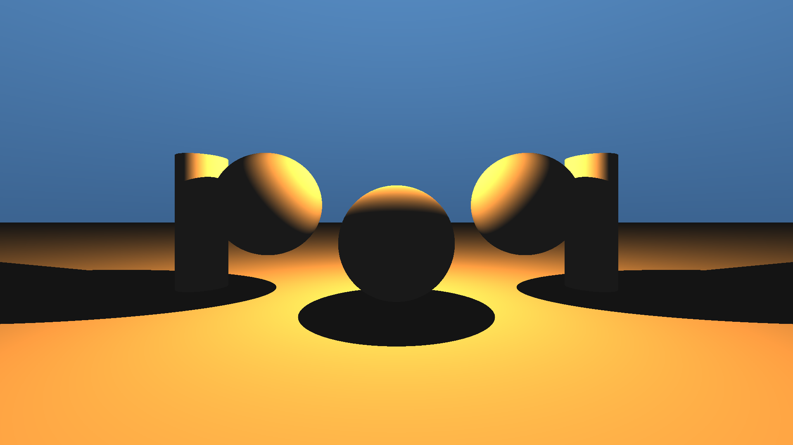
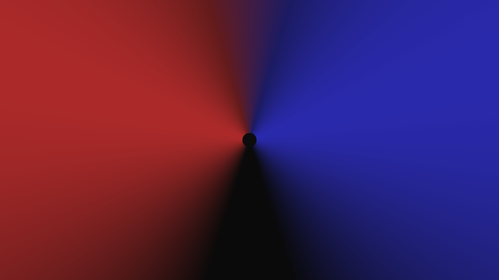
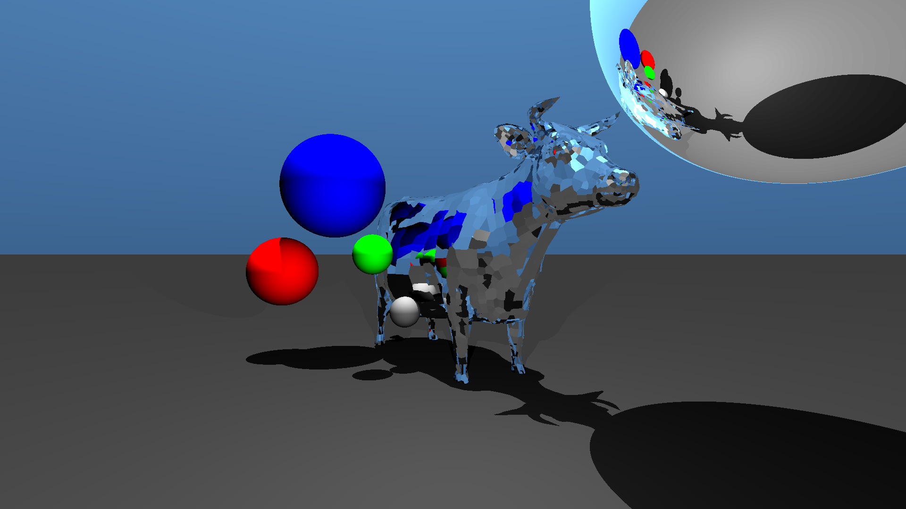
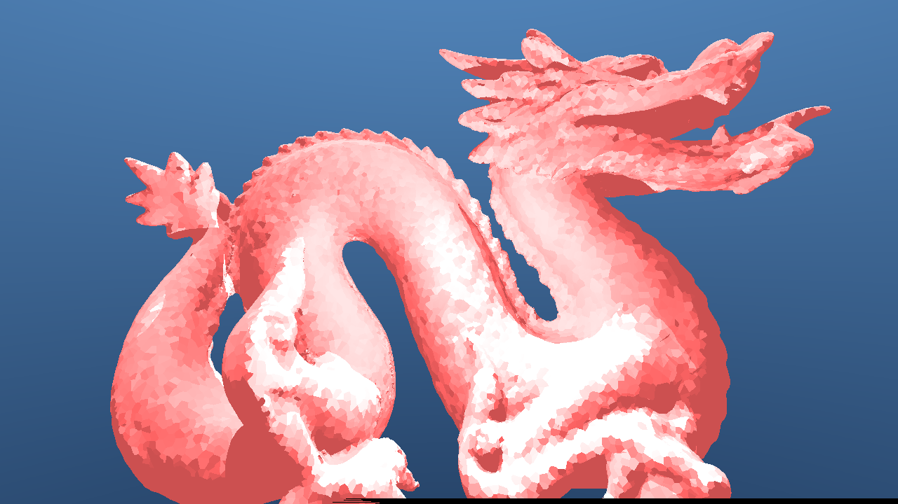

# Raytracer

A raytracer is a program that creates images by simulating the way light
travels in the real world. Instead of drawing shapes on a screen, it follows
imaginary rays of light for every single pixel, bouncing them off objects,
picking up their colors, and working out where shadows fall. The result is a
photorealistic picture built entirely from a text description of a scene.

This project is a raytracer written in C++. You describe a 3D world in a simple
configuration file (where the objects are, what color they are, where the lights
sit, where the camera looks), and the program renders it into an image.

---

## What it can do

Here are real images produced by this raytracer.

### Basic shapes

Spheres and cylinders sitting on a floor, each with its own color, lit by a
light source that casts soft shadows on the ground.



### Lights and shading

The same kind of scene, but showing how a warm light wraps around the objects.
Notice how each shape is bright where it faces the light and dark on the far
side, exactly like objects in real life.



### Emissive (glowing) lights

Objects can also give off their own colored light. Here two glowing sources,
one red and one blue, bathe the scene from opposite sides.



### Reflections and complex scenes

Surfaces can act like mirrors. Here a mirror cow and a mirror ball reflect the
colored spheres and the world around them.



### Detailed 3D models

The raytracer can load complex 3D models made of thousands of tiny triangles.
This is the classic Stanford Dragon, rendered from such a model.



---

## Main features

- **Multiple shapes**: spheres, cylinders, planes, triangles, and full 3D
  models loaded from `.obj` files.
- **Lighting**: directional lights, point lights, ambient light, and glowing
  (emissive) objects.
- **Realistic materials**: reflection (mirrors), refraction (glass), and
  transparency.
- **Shadows** cast by objects onto one another.
- **Live preview** in a window while the image renders (using SFML).
- **Fast rendering** thanks to multithreading (using every core of your
  processor at once).
- **Distributed rendering**: split the work across several computers over a
  network with a server/client mode.
- **Plugin system**: every shape and light is a separate add-on module, so the
  raytracer can be extended without touching the main program.

---

## Getting started

These steps work on Linux, or on Windows through WSL (Windows Subsystem for
Linux).

### 1. Install the dependencies

```bash
sudo apt update
sudo apt install -y cmake libconfig++-dev libsfml-dev build-essential
```

### 2. Build the project

```bash
cmake . -B build
cmake --build build
```

This produces a `raytracer` program and compiles all the shape and light
plugins.

### 3. Render a scene

```bash
./raytracer <scene_file>
```

Where `<scene_file>` is a configuration file describing your 3D world (see
below). A window opens showing the image as it is being drawn, and the final
result is saved to disk.

To see all the options at any time:

```bash
./raytracer --help
```

### Rendering across several machines

For heavy scenes you can share the work between computers:

```bash
# On the main machine (the server)
./raytracer --server <scene_file> <port>

# On each helper machine (a client)
./raytracer --client <server_ip> <port>
```

---

## Describing a scene

Scenes are plain text files. You list the objects, their positions, sizes, and
colors, plus the lights and the camera. For example, a single red sphere:

```
primitives: {
  spheres: [
    { x = 60; y = 5; z = 40; r = 25; color = { r = 255; g = 64; b = 64; }; }
  ]
}
```

Coordinates place the object in 3D space, `r` is its radius, and `color` is its
red/green/blue value (0 to 255). Add more objects and lights to build up scenes
like the ones shown above.

---

## Project structure

- `project/` — the C++ source code of the raytracer engine.
- `plugins/` — one folder per shape or light (sphere, cylinder, plane,
  triangle, mesh, point light, directional light, ambient light...). Each is
  compiled into a `raytracer_<name>.so` add-on.
- `shared/` — the shared interfaces every plugin builds on (`IObject`,
  `ILight`, math helpers, textures...).
- `resources/` — the example images shown in this README.

---

## For developers: writing a plugin

Each shape and light lives in its own folder under `plugins/` and is compiled
into a shared library named `raytracer_<name>.so`. A plugin includes either
`IObject.hpp` (for a shape) or `ILight.hpp` (for a light) from `shared/`, and
must expose two `extern "C"` functions:

```cpp
// Tell the engine what kind of plugin this is: OBJECT or LIGHT
extern "C" SoTypeEnum GetSoType(void) {
    return OBJECT;
}

// Build an instance from the parameters read in the scene file
extern "C" IObject *GetObject(std::map<std::string, std::string> params) {
    return new MyShape(params);
}
```

The engine passes the scene parameters as a map of key/value strings. Nested
values from the configuration file use dot notation, so `color = { r = 255; }`
becomes the key `color.r`. Each plugin documents the parameters it expects in
its own `README.md`.

Common build flags: `-Wall -Wextra -Werror`. If a plugin fails to load, the
loader prints the `dlopen`/`dlsym` error at runtime.
